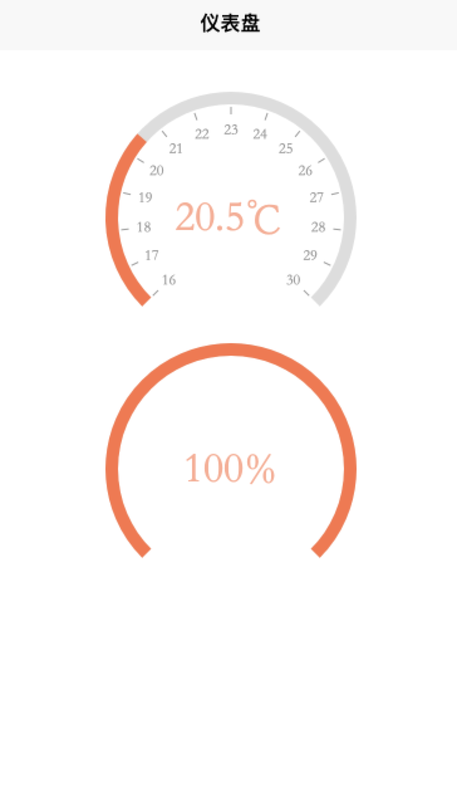

# 仪表盘

## 自定义仪表盘

使用`canvas`自定义仪表盘，通过文件引入类`Gauge`,实例化传参来运行



## 功能

- [x] 刻度线显示
- [x] 当前值显示
- [x] 固定起始终止角度
- [x] 既可当做仪表盘，也可以当做环形进度条使用
- [x] 渐变色
- [x] 动画

没有做太多的扩展性设计，可将组件下载下来自行设置以符合不同业务的需求

## 参数

| 参数 | 说明 | 默认值 | 是否必填
|--|--|--|--|
| canvasId | canvasId | | 必填
| startAngle | 圆弧开口起始弧度 | `3 / 4 * Math.PI`，角度为`135`度 | 选填
| endAngle | 圆弧开口结束弧度 | `1 / 4 * Math.PI`，角度为`45` | 选填
| value | 当前显示值（未做浮点数据处理） | `0` | 选填
| width | 宽度 | `200` | 选填
| min | 最小值 | `0` | 选填
| max | 最大值 | `100` | 选填
| unit | 单位 | `%` | 选填
| showTick | 是否暂时刻度线 | `false` | 选填
| progressColor | 进度条颜色，渐变色使用color数组`[]` | `#FD7347` | 选填
| trackColor | 滑动轨迹颜色 | `#F1F1F1` | 选填
| valueColor | 当前值颜色 | `#000` | 选填
| lineWidth | 圆环宽度 | `10` | 选填

- 仪表盘设计是顺时针旋转，暂时不支持逆时针旋转

## 使用案例

- 提供两个demo供参考

```vue
<template>
  <view class="gauge-container">
    <view class="title">温度类</view>
    <canvas class="canvas" canvas-id="canvas"></canvas>
    <view class="title">进度类</view>
    <canvas class="canvas" canvas-id="canvas2"></canvas>
  </view>
</template>

<script>
import Gauge from "./index.js";
export default {
  name: "gauge",
  data() {
    return {};
  },
  mounted() {
    new Gauge({
      canvasId: "canvas",
      width: 200,
      min: 16,
      max: 30,
      value: 20.5,
      unit: "℃",
      showTick: true,
    });
    new Gauge({
      canvasId: "canvas2",
      value: 80,
      lineWidth: 20,
      progressColor: ["#2196F3", "#9C27B0", "#F44336"],
      valueColor: "blue",
    });
  },
};
</script>

<style>
.gauge-container {
  padding: 20rpx 40rpx;
  text-align: left;
}
.title {
  margin-bottom: 20rpx;
  color: #000;
  font-size: 32rpx;
  font-weight: 500;
}
.canvas {
  width: 200px;
  height: 200px;
  margin: 40rpx auto;
}
</style>
```